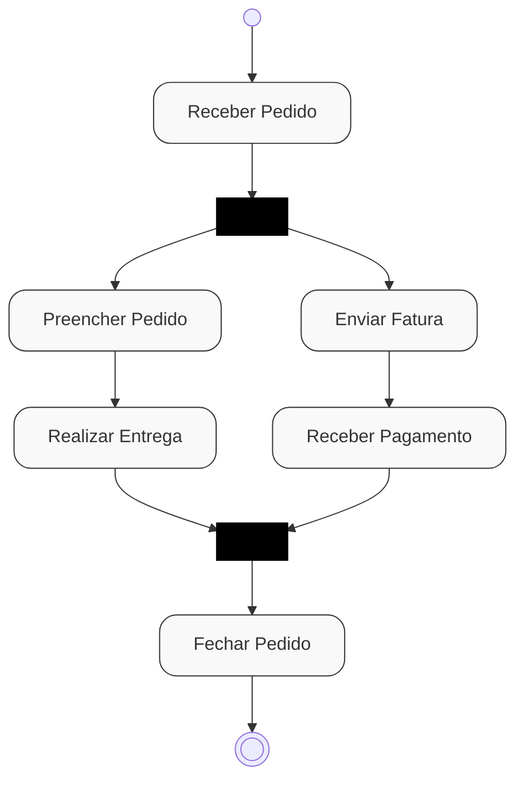

```mermaid
graph TD
    %% Nó Inicial
    Start(( )) --> Receber[Receber Pedido]

    %% Barra de Fork (Paralelismo)
    Receber --> Fork_Bar[ ]
    style Fork_Bar fill:#000,stroke:#000,stroke-width:4px

    %% Fluxo de Entrega
    Fork_Bar --> Preencher[Preencher Pedido]
    Preencher --> Entrega[Realizar Entrega]

    %% Fluxo de Faturamento
    Fork_Bar --> Fatura[Enviar Fatura]
    Fatura --> Pagamento[Receber Pagamento]

    %% Barra de Join (Sincronização)
    Entrega --> Join_Bar[ ]
    Pagamento --> Join_Bar[ ]
    style Join_Bar fill:#000,stroke:#000,stroke-width:4px

    %% Finalização
    Join_Bar --> Fechar[Fechar Pedido]
    Fechar --> End((( )))

    %% Estilização das caixas para ficarem arredondadas como na foto
    classDef box rx:15,ry:15,fill:#f9f9f9,stroke:#333,stroke-width:1px
    class Receber,Preencher,Entrega,Fatura,Pagamento,Fechar box
```
